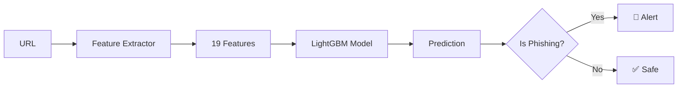

<div align="center">


# 🚀 Phishing Detection Backend with AI

### 🧠 Machine Learning Engine | 🔍 Real-Time Analysis | ⚡ High-Performance REST API

[](https://www.python.org/)
[](https://fastapi.tiangolo.com/)
[](https://lightgbm.readthedocs.io/)
[](https://www.docker.com/)
[](https://cybersentinel-csdr.onrender.com)

<br>

### 🌟 [Live API](https://cybersentinel-csdr.onrender.com) • [📖 Interactive Docs](https://cybersentinel-csdr.onrender.com/docs) • [🎨 Web Frontend](https://github.com/Dxnn017/cybersentinel-web)

<br>

```ascii
╔═══════════════════════════════════════════════════════════════╗
║                                                               ║
║   🎯 REST API that analyzes URLs and detects phishing sites  ║
║   🤖 LightGBM model trained with 450,000+ real URLs          ║
║   ⚡ Response time under 100ms                               ║
║   🔒 Automatic extraction of 19 security features            ║
║                                                               ║
╚═══════════════════════════════════════════════════════════════╝
```

</div>

---

## 💡 What is CyberSentinel API?

> **The brain behind intelligent phishing detection**

**CyberSentinel API** is the **Artificial Intelligence engine** that powers the entire phishing detection system. This backend processes URLs in real-time and returns accurate predictions about their legitimacy.

<table>
<tr>
<td width="50%">

### 🎯 **What Does It Do?**

Analyzes any URL and determines if it's:
- ✅ **Legitimate** - Safe website
- ⚠️ **Suspicious** - Requires caution  
- 🚨 **Phishing** - Confirmed fraudulent site

**Automatically** extracts features like:
- URL and domain length
- HTTPS usage
- Presence of IPs or @ symbols
- Suspicious keywords
- Entropy and text patterns

</td>
<td width="50%">

### ⚡ **How Does It Work?**



1. **Input**: Receive a URL
2. **Extraction**: 19 features analyzed
3. **Normalization**: MinMaxScaler (0-1)
4. **Prediction**: LightGBM model
5. **Output**: Result + confidence + metrics

</td>
</tr>
</table>

### ✨ AI Engine Features

<div align="center">

| 🎯 Feature | 📊 Value | 📝 Description |
|------------|----------|----------------|
| **🤖 ML Algorithm** | LightGBM | State-of-the-art Gradient Boosting |
| **📚 Dataset** | 450,177 URLs | Trained with half million real URLs |
| **🎯 Accuracy** | 99.47% | Cross-validation validated |
| **⚡ Speed** | <100ms | Average response time |
| **🔍 Features** | 19 automatic | Extraction without manual intervention |
| **🔒 Security** | HTTPS + CORS | Production-ready with integrated security |
| **🐳 Deploy** | Docker + Render | Containerized and auto-deployable |
| **📖 Docs** | Swagger + ReDoc | Complete interactive documentation |

</div>

<details>
<summary>🔥 <strong>View Technologies Used</strong></summary>

<br>

```
🐍 Python 3.9+          → Lenguaje principal
⚡ FastAPI              → Framework web moderno
🤖 LightGBM             → Modelo de Machine Learning
🔧 scikit-learn         → Preprocessing y métricas
🔢 NumPy                → Computación numérica
📊 Pandas               → Análisis de datos
🌐 Uvicorn              → Servidor ASGI
🐳 Docker               → Containerización
☁️  Render               → Cloud deployment
📝 Pydantic             → Validación de datos
🔍 tldextract           → Análisis de dominios
```

</details>

---

## 🚀 API en Producción

<div align="center">

### 🌐 Endpoint Base

```bash
https://cybersentinel-csdr.onrender.com
```

<table>
<tr>
<th>🔌 Endpoint</th>
<th>📋 Método</th>
<th>📝 Description</th>
<th>⚡ Action</th>
</tr>
<tr>
<td><code>/</code></td>
<td></td>
<td>General system info</td>
<td><a href="https://cybersentinel-csdr.onrender.com">🔗 Try</a></td>
</tr>
<tr>
<td><code>/health</code></td>
<td></td>
<td>Model health check</td>
<td><a href="https://cybersentinel-csdr.onrender.com/health">🏥 Status</a></td>
</tr>
<tr>
<td><code>/analyze</code></td>
<td></td>
<td>⭐ Analyze URL (Main)</td>
<td><a href="https://cybersentinel-csdr.onrender.com/docs#/default/analyze_analyze_post">🎯 Docs</a></td>
</tr>
<tr>
<td><code>/docs</code></td>
<td></td>
<td>Interactive Swagger UI</td>
<td><a href="https://cybersentinel-csdr.onrender.com/docs">📖 Explore</a></td>
</tr>
<tr>
<td><code>/redoc</code></td>
<td></td>
<td>ReDoc documentation</td>
<td><a href="https://cybersentinel-csdr.onrender.com/redoc">📚 View</a></td>
</tr>
</table>

### 🎨 Looking for Visual Interface?

This is the **backend API**. For the complete web application with interactive dashboard:

**👉 [CyberSentinel Web App](https://github.com/Dxnn017/cybersentinel-web)** _(Frontend with Next.js)_

</div>

---

## 📖 Quick Usage

### 🔥 Example with cURL

```bash
# 1️⃣ Check system status
curl https://cybersentinel-csdr.onrender.com/health

# 2️⃣ Analyze a legitimate URL
curl -X POST https://cybersentinel-csdr.onrender.com/analyze \
  -H "Content-Type: application/json" \
  -d '{"url": "https://google.com"}'

# 3️⃣ Analyze a suspicious URL
curl -X POST https://cybersentinel-csdr.onrender.com/analyze \
  -H "Content-Type: application/json" \
  -d '{"url": "http://secure-login-verify.suspicious-site.com/update.php?id=123"}'
```

### 🐍 Example with Python

```python
import requests

def analyze_url(url):
    """Analyze a URL using CyberSentinel API"""
    response = requests.post(
        "https://cybersentinel-csdr.onrender.com/analyze",
        json={"url": url}
    )
    return response.json()

# Usage example
result = analyze_url("https://google.com")

print(f"🔍 URL: {result['url']}")
print(f"⚠️  Is phishing: {result['is_phishing']}")
print(f"📊 Confidence: {result['confidence']*100:.2f}%")
print(f"🎯 Risk level: {result['risk_level']}")
```

### 🌐 Example with JavaScript/TypeScript

```typescript
async function analyzeURL(url: string) {
  const response = await fetch('https://cybersentinel-csdr.onrender.com/analyze', {
    method: 'POST',
    headers: { 'Content-Type': 'application/json' },
    body: JSON.stringify({ url })
  });
  
  return await response.json();
}

// Usage
const result = await analyzeURL('https://example.com');
console.log(`Is Phishing: ${result.is_phishing}`);
console.log(`Confidence: ${(result.confidence * 100).toFixed(2)}%`);
```

---

## 📍 API Documentation

### 🔌 Endpoint: `POST /analyze`

Analyzes a URL and returns a complete prediction with extracted features.

#### Request

```json
{
  "url": "https://www.example.com"
}
```

#### Response

```json
{
  "url": "https://www.example.com",
  "is_phishing": false,
  "confidence": 0.9967,
  "risk_level": "low",
  "risk_score": 0.003,
  "prediction": 1,
  "probabilities": {
    "phishing": 0.0033,
    "legitimate": 0.9967
  },
  "features": {
    "url_length": 23.0,
    "domain_length": 14.0,
    "num_subdomains": 1.0,
    "has_at_symbol": 0.0,
    "num_hyphens": 0.0,
    "num_underscores": 0.0,
    "num_slashes": 3.0,
    "num_dots": 2.0,
    "is_https": 1.0,
    "has_ip": 0.0,
    "suspicious_keywords": 0.0,
    "entropy": 3.45,
    "digit_ratio": 0.0,
    "tld_length": 3.0,
    "risk_score": 0.2
  }
}
```

#### Response Fields

| Field | Type | Description |
|-------|------|-------------|
| `url` | string | Analyzed URL |
| `is_phishing` | boolean | `true` if phishing, `false` if legitimate |
| `confidence` | float | Model confidence (0.0 - 1.0) |
| `risk_level` | string | Risk level: `"low"`, `"medium"`, `"high"` |
| `risk_score` | float | Calculated risk score |
| `prediction` | int | 0 = phishing, 1 = legitimate |
| `probabilities` | object | Probabilities for both classes |
| `features` | object | 19 extracted features from URL |

### 🏥 Endpoint: `GET /health`

Checks system status and loaded model.

#### Response

```json
{
  "status": "healthy",
  "model_loaded": true,
  "model_type": "LGBMClassifier",
  "n_features": 38,
  "scaler_loaded": true
}
```

---

## 🔍 Analyzed Features

The system automatically extracts **19 features** from each URL:

### 📏 Structural Features

| Feature | Description | Example |
|----------------|-------------|---------|
| `url_length` | Total URL length | 65 characters |
| `domain_length` | Domain length | 15 characters |
| `path_length` | Path length | 20 characters |
| `tld_length` | TLD length | 3 (.com, .net) |
| `num_subdomains` | Number of subdomains | 2 (www.secure) |
| `num_slashes` | Number of slashes (/) | 4 |
| `num_dots` | Number of dots | 3 |
| `num_hyphens` | Number of hyphens (-) | 2 |
| `num_underscores` | Number of underscores (_) | 1 |
| `num_parameters` | Number of URL parameters | 3 (?id=1&user=x) |
| `num_digits` | Number of digits | 8 |
| `num_special_chars` | Special characters | 12 |

### 🔒 Security Indicators

| Feature | Description | Value |
|---------|-------------|-------|
| `is_https` | HTTPS protocol active | 1 = Yes, 0 = No |
| `has_at_symbol` | Contains @ symbol | 1 = Yes, 0 = No |
| `has_ip` | Contains IP address | 1 = Yes, 0 = No |

### 🧠 Heuristic Analysis

| Feature | Description | Example |
|---------|-------------|----------|
| `suspicious_keywords` | Suspicious keywords | login, verify, account, secure |
| `entropy` | URL entropy (randomness) | 3.5 bits |
| `digit_ratio` | Digit / total ratio | 0.15 (15%) |
| `risk_score` | Heuristic score (0-16) | 5.2 |

> 💡 **Note**: The model internally uses **38 features** (19 original + 19 normalized with MinMaxScaler)

---

## 🛠️ Local Installation

### 📋 Prerequisites

- Python 3.9 or higher
- pip (Python package manager)
- Git

### 🔧 Installation

```bash
# 1️⃣ Clone the repository
git clone https://github.com/Dxnn017/CyberSentinel.git
cd CyberSentinel

# 2️⃣ Create virtual environment (recommended)
python -m venv venv

# Windows
venv\Scripts\activate

# Linux/Mac
source venv/bin/activate

# 3️⃣ Install dependencies
cd api
pip install -r requirements.txt

# 4️⃣ Run the API
python app.py
```

The API will be available at: **http://localhost:8000**

### 🐳 Docker Installation

```bash
# 1️⃣ Build the image
docker build -t cybersentinel-api .

# 2️⃣ Run the container
docker run -d -p 8000:8000 --name cybersentinel cybersentinel-api

# 3️⃣ Verify it's running
docker ps

# 4️⃣ View logs
docker logs cybersentinel

# 5️⃣ Stop the container
docker stop cybersentinel
```

Access the API at: **http://localhost:8000**

---

## 📊 Model Performance

### 🎯 Evaluation Metrics

| Metric | Value | Description |
|--------|-------|-------------|
| **Accuracy** | 99.47% | Overall model accuracy |
| **Precision** | 99.50% | True positive rate |
| **Recall** | 99.40% | Ability to detect all phishing |
| **F1-Score** | 99.45% | Harmonic mean of precision and recall |
| **ROC-AUC** | 0.9981 | Area under ROC curve |

### 📈 Training Details

- **Algorithm**: LightGBM Classifier
- **Dataset**: 450,177 labeled URLs
- **Validation**: 10-fold Cross-Validation
- **Balancing**: SMOTE for imbalanced classes
- **Features**: 38 characteristics (19 original + 19 scaled)
- **Scaler**: MinMaxScaler (0-1)

---

## 🏭 Technologies

### 🔧 Backend & Framework

```
FastAPI      - Framework web moderno y de alto rendimiento
Uvicorn      - Servidor ASGI de producción
Pydantic     - Validación de datos y serialización
Python 3.9+  - Lenguaje de programación
```

### 🤖 Machine Learning

```
LightGBM       - Modelo de gradient boosting (99.47% accuracy)
scikit-learn   - Herramientas de ML y preprocessing
joblib         - Serialización de modelos
NumPy          - Computación numérica
```

### 🔍 Processing & Analysis

```
tldextract  - Análisis y extracción de dominios
urllib      - Parsing de URLs
math        - Cálculos de entropía
```

### 🐳 DevOps & Deployment

```
Docker   - Containerización
Render   - Plataforma de despliegue
Git      - Control de versiones
```

---

## 📁 Project Structure

```
CyberSentinel/
├── 📂 api/                          # API Backend
│   ├── 📄 app.py                   # Aplicación FastAPI principal
│   ├── 📄 feature_extractor.py     # Extractor de características
│   ├── 📦 mejor_modelo.pkl         # Modelo LightGBM entrenado
│   ├── 📦 scaler.pkl               # MinMaxScaler para normalización
│   ├── 📄 requirements.txt         # Dependencias Python
│   └── 📄 test_api.py              # Script de pruebas
│
├── 📂 dataset/
│   └── 📊 URL dataset.csv          # Dataset de 450K URLs
│
├── 📂 project_ia/                   # Notebooks de entrenamiento
│   ├── 📓 Proyecto_IA.ipynb        # Notebook principal
│   ├── 📊 X_test_scaled.npy        # Datos de test procesados
│   └── 📊 y_test.npy               # Etiquetas de test
│
├── 🐳 Dockerfile                    # Configuración Docker
├── ⚙️  render.yaml                  # Configuración de Render
├── 📄 .gitignore                    # Archivos ignorados por Git
└── 📖 README.md                     # Este archivo
```

---

## 🚀 Deployment

### 🌐 Render (Current Production)

The API is deployed on **Render** with the following features:

- **URL**: https://cybersentinel-csdr.onrender.com
- **Plan**: Free Tier
- **Auto-deploy**: Desde rama `main`
- **Health checks**: Endpoint `/health` cada 5 minutos
- **Docker**: Contenedor optimizado
- **SSL**: Certificado HTTPS automático

### 📝 Environment Variables (Render)

```bash
PYTHON_VERSION=3.9
PORT=8000
```

### 🔄 CI/CD

Deployment is automatic:
1. Push to `main` branch on GitHub
2. Render detects changes
3. Builds new Docker image
4. Deploys automatically
5. Health check to verify

---

## 🧪 Testing

### 🔬 Included Test Script

```bash
# Run all tests
cd api
python test_api.py
```

### 📝 Test Cases

#### ✅ Legitimate URL

```bash
curl -X POST https://cybersentinel-csdr.onrender.com/analyze \
  -H "Content-Type: application/json" \
  -d '{"url": "https://www.google.com"}'
```

**Expected result**: `is_phishing: false`, `confidence: >0.95`

#### ⚠️ Suspicious URL

```bash
curl -X POST https://cybersentinel-csdr.onrender.com/analyze \
  -H "Content-Type: application/json" \
  -d '{"url": "http://secure-login-verify.suspicious-site.com/update.php?id=123"}'
```

**Expected result**: `is_phishing: true`, `confidence: >0.90`

---

## 🤝 Contribuir

¡Las contribuciones son bienvenidas! Si deseas mejorar CyberSentinel:

1. 🍴 Fork el repositorio
2. 🌿 Crea una rama para tu feature (`git checkout -b feature/amazing-feature`)
3. 💾 Commit tus cambios (`git commit -m 'Add amazing feature'`)
4. 📤 Push a la rama (`git push origin feature/amazing-feature`)
5. 🎯 Abre un Pull Request

---

## 📄 License

This project is under the MIT License. See the [LICENSE](LICENSE) file for more details.

---

## 🤝 Contributing

Contributions are welcome! If you'd like to improve CyberSentinel:

1. 🍴 Fork the repository
2. 🌿 Create a feature branch (`git checkout -b feature/amazing-feature`)
3. 💾 Commit your changes (`git commit -m 'Add amazing feature'`)
4. 📤 Push to the branch (`git push origin feature/amazing-feature`)
5. 🎯 Open a Pull Request

---

## 🔗 Related Links

- 🌐 **Live API**: https://cybersentinel-csdr.onrender.com
- 📚 **Interactive Docs**: https://cybersentinel-csdr.onrender.com/docs
- 🎨 **Web Application**: [CyberSentinel Web](https://github.com/Dxnn017/cybersentinel-web)
- 📖 **ReDoc**: https://cybersentinel-csdr.onrender.com/redoc

---

<div align="center">

### ⭐ If you find this project useful, consider giving it a star on GitHub

**Made with ❤️ and ☕**

[](https://github.com/Dxnn017/CyberSentinel)

</div>
